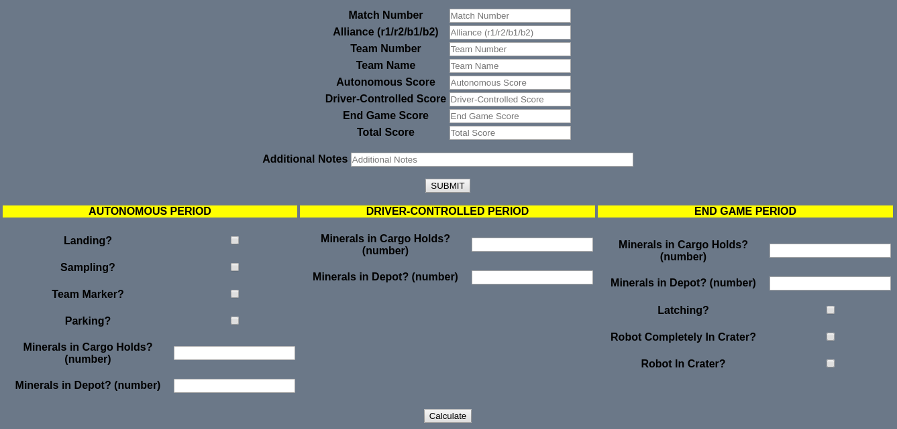
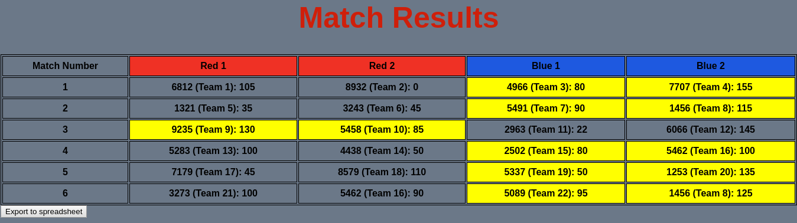
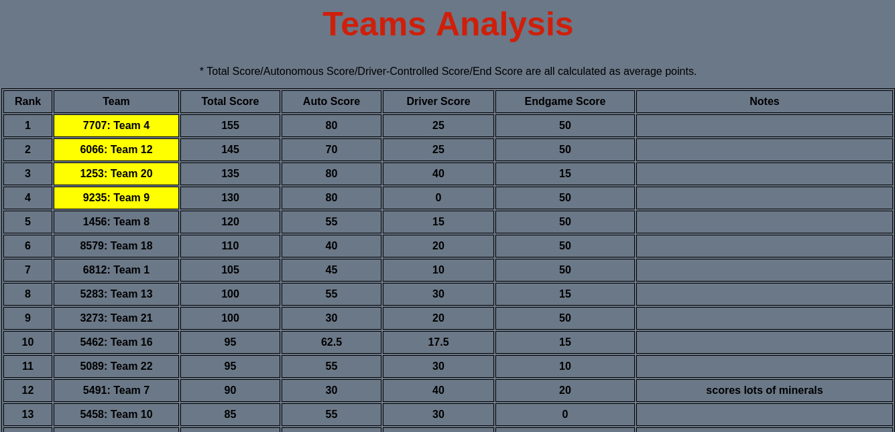

# FTC-Scouting-App
Scouting web app for FTC Robotics: https://ftcscouting.herokuapp.com

## Usage

Create one account per team for a meet.
All team members scouting should login with that same team account.

## Submitting Match Results

NOTE: The current scoring system is based off the 2018-2019 season game Rover Ruckus.

For each match, optimally four people should each scout one of the four teams' robot per match.

Prior to the match, one should fill out the match number, alliance (r1,r2,b1,or b2), team name, and team number that they are scouting.

During the match, the robot's success in meeting the scoring objectives during the autonomous, driver-controlled, and end game period can be filled out. Clicking the 'Calculate' button should automatically calculate and update the scores for submission.

Additional notes on the robot's performance, etc. can also be added (optional).

When done, click the 'Submit' button.

## View Results

This shows the results of matches: total score earned by each team and which alliance won in that match.

You can also export the results to a spreadsheet (CSV 
file).

## Final Analysis

This ranks the teams based off total points earned. The total points, autonomous score, driver-controlled period score, and end game score are all averaged to show the expected amount of points to be gained in one match. Additional notes on the team's robot are also added into the table, helping in selecting alliances for the finals.

You can also export the results to a spreadsheet (CSV file).